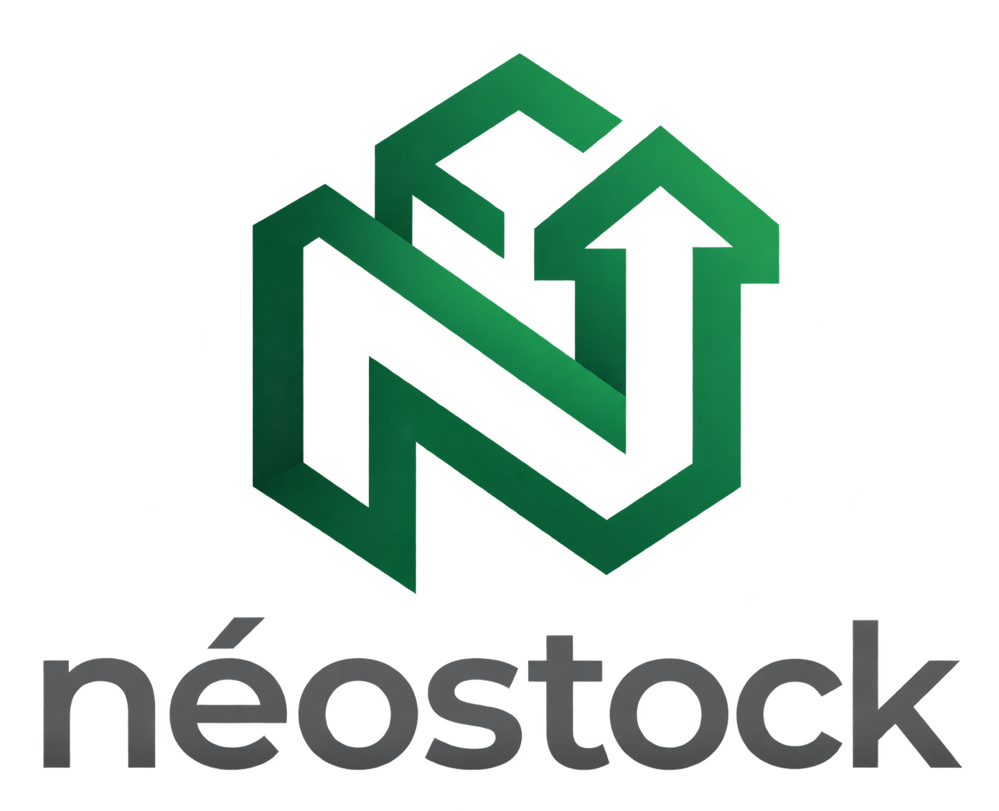

# 🇹🇳 neostock — Intelligence d'Approvisionnement IA & Terminal Marché B2B

<p align="center">
  
</p>

<p align="center">
  <a href="https://hackthon-store-dashbord.pages.dev"></a>
  <a href="hackthonvideo.mp4"></a>
  
  
</p>

> **Projet Hackathon "Come Build with AI" (27 Septembre 2026)**  
> **Accès Démo Direct :** [https://hackthon-store-dashbord.pages.dev](https://hackthon-store-dashbord.pages.dev)  
> **🎬 Démo Vidéo (90s) :** [Regarder / Télécharger hackthonvideo.mp4](hackthonvideo.mp4)  
> **Compte Prêt à l'Emploi (1 Clic) :** `ahmed@epicerie.tn` / `demo123`

---

## 📌 Présentation du Projet (Résumé < 150 mots)

**neostock** résout le problème critique des ruptures de stock et des marges écrasées qui font perdre 1.5% à 4% de chiffre d'affaires aux 120 000+ épiceries et commerces de proximité en Tunisie. Notre plateforme combine **Google Gemini 2.5 Flash** avec la formule d'approvisionnement optimal **EOQ (Economic Order Quantity)**, le **calendrier saisonnier agricole et commercial tunisien** (Ramadan, été, rentrée scolaire), et un ensemble statistique prédictif (WMA, EMA, SMA). L'assistant prédit la demande, calcule précisément les jours avant rupture par rapport aux délais grossistes, et génère des bons de commande WhatsApp instantanés. De plus, neostock inaugure le premier **terminal de marché de gros B2B en direct** et des **pools d'achats groupés**, permettant aux commerçants de mutualiser leurs volumes pour obtenir jusqu'à -20% de remise d'usine.

---

## 🚀 Fonctionnalités Clés

### 1. 🧮 Simulateur de Pertes Interactif (Landing Page)
- Inspiré de Visiogain, un calculateur en direct permet au commerçant de faire glisser son chiffre d'affaires et d'estimer instantanément l'argent perdu chaque mois par rupture et démarque.
- Bouton de connexion directe en 1 Clic (`Se connecter en 1 Clic →`) sans saisie manuelle.

### 2. 📊 Tableau de Bord & Arbitrage IA Instantané
- **Bannières d'arbitrage automatisées :**
  - 🔴 **RISQUE DE RUPTURE** : couverture restante $\le$ délai fournisseur.
  - 🟠 **ATTENTION** : couverture critique sous 5 jours.
  - 🟢 **STOCK SUFFISANT** : trésorerie préservée.
- **Calcul EOQ & Point de Commande :** Quantité économique optimale, stock de sécurité, rotation des stocks et marge brute calculés en temps réel.
- **💬 Bon WhatsApp en 1 Clic :** Génération immédiate d'un message standardisé de bon de commande prêt à envoyer au grossiste.

### 3. 📈 Terminal Marché de Gros B2B & Groupements d'Achats
- **Mercuriale Nationale en Direct :** Suivi des cours de référence de Bir El Kassâa, Sfax et des centrales d'achat (Huile d'olive, Café Robusta, Couscous Randa, Lait UHT, Dattes Deglet Nour).
- **Bulletin Stratégique Gemini 2.5 Flash :** Analyse continue des tensions de marché et des quotas nationaux (Lait & Café) avec recommandations de posture d'achat (offensive vs défensive).
- **Groupements d'Achats Inter-Épiceries :** Pools d'achat actifs permettant à des commerces voisins de se regrouper pour acheter au tarif usine direct (-15% à -20%).

### 4. 🌐 Architecture Serverless & Bilingue
- Bouton de bascule de langue instantané (`🇫🇷 FR` / `🇬🇧 EN`) situé en haut à gauche de chaque page.
- Déploiement serverless global sur **Cloudflare Edge Workers** avec temps de réponse inférieur à 50ms en Tunisie.

---

## 🏗️ Architecture du Système

```
┌────────────────────────────────────────────────────────────────────────┐
│                        CLIENT WEB BILINGUE (FR / EN)                   │
│   • React 18, Vite, Tailwind CSS, Recharts                             │
│   • Top-Left Language Switcher (FR / EN)                               │
│   • WhatsApp Deep-Linking & Simulateur Visiogain                       │
└───────────────────────────────────┬────────────────────────────────────┘
                                    │
                                    │ HTTPS (API /api)
                                    ▼
┌────────────────────────────────────────────────────────────────────────┐
│               CLOUDFLARE EDGE FUNCTIONS (V8 Serverless)                │
│   • frontend/functions/api/[[route]].js                                │
│   • Routage REST : /products, /market, /ai, /transactions              │
│   • Isolation des clés secrètes dans Cloudflare Secret Vault           │
└───────────────────────┬────────────────────────┬───────────────────────┘
                        │                        │
         Appels IA Edge │                        │ Moteur Statistique Local
                        ▼                        ▼
┌───────────────────────────────┐        ┌───────────────────────────────┐
│     GOOGLE GEMINI 2.5 FLASH   │        │   SMARTSTOCK ANALYTICS v2.0   │
│  • Bulletin Marché B2B Live   │        │  • Formule Wilson EOQ         │
│  • Assistant RAG & Calendrier │        │  • Ensemble WMA / EMA / SMA   │
│  • Raisonnement économique    │        │  • Saisons Tunisiennes        │
└───────────────────────────────┘        └───────────────────────────────┘
```

---

## 🛠️ Démarrage Local

### Prérequis
- Node.js 18+ et npm
- Python 3.10+ (pour le backend local optionnel)

### 1. Lancer le Frontend React
```bash
cd frontend
npm install
npm run dev
```
L'application est accessible sur `http://localhost:5173`.

### 2. Lancer le Backend Python FastAPI (Optionnel)
```bash
cd backend
python -m venv venv
# Windows :
venv\Scripts\activate
# Linux/Mac :
# source venv/bin/activate
pip install -r requirements.txt
uvicorn main:app --host 0.0.0.0 --port 8000 --reload
```

---

## 🤖 Divulgation IA & Outils (AI Disclosure)

Conformément au règlement du hackathon :
- **Modèle Fondateur IA :** Google Gemini 2.5 Flash via proxy Edge Cloudflare sécurisé.
- **Moteur Mathématique :** Modèle Wilson EOQ (Operations Research) + Ensemble Time-Series (WMA, EMA, SMA).
- **NVIDIA Brev :** Non utilisé.
- **Sécurité :** Aucune clé API, aucun mot de passe ni identifiant confidentiel n'est présent dans le code client ou le dépôt public. Toutes les clés sont isolées dans le coffre-fort de secrets Cloudflare.
- **Données :** Données de cours mercuriales réelles (Bir El Kassâa, Sfax) et ventes synthétiques étalonnées sur les volumes de distribution tunisiens.

---

## 👥 Équipe & Contact
- **Application :** neostock 🇹🇳
- **URL Démo en Ligne :** [https://hackthon-store-dashbord.pages.dev](https://hackthon-store-dashbord.pages.dev)
